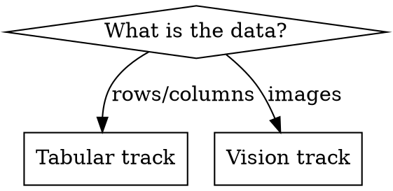

# Academic ML Workflow

## Overview

Single orchestrator for academic ML projects of any data type. The grade is on the *recorrido*
(every decision traceable to evidence) and on honest, critical analysis — not on the final
metric. This skill gates each phase on a concrete deliverable and routes to the right sub-skill
depending on whether the data is **tabular** or **images**.

## When to use

- Starting a parcial / TP / final with a dataset and a modeling goal
- A folder has a `consigna` and no analysis yet

Do NOT use:
- For a single isolated phase (invoke that phase's sub-skill directly)
- For production ML serving/MLOps (this is academic)

## Branch first: tabular vs vision

## Phases and sub-skills

| Phase | Tabular sub-skill | Vision sub-skill |
|---|---|---|
| 01. Adquisición | [[tabular-data-acquisition]] | [[image-dataset-acquisition]] |
| 02. EDA | [[eda-with-narrative]] | [[image-eda]] |
| 03. Preparación | [[feature-engineering-justified]] | [[image-preprocessing-augmentation]] |
| 04. Métrica | (this skill — derive from the question + class balance) | idem |
| 05. Arquitectura | (this skill / domain default) | [[cnn-architecture-design]] |
| 06-07. Iteración | [[nn-iteration-with-error-analysis]] | [[nn-iteration-with-error-analysis]] |
| 08. Interpretabilidad | [[model-interpretability]] | [[model-interpretability]] |
| 09. Insights | [[ds-business-insights]] | [[ds-business-insights]] |
| 10. Entregables | [[ds-presentation-deliverable]] | [[ds-presentation-deliverable]] |

## Verification gate (between phases)

Before phase N→N+1, confirm:
1. The phase produced its expected outputs in the expected paths.
2. Auto-review found no critical issue (numbers coherent, captions present, no leakage).
3. The decision the phase had to make is recorded (metric chosen, channels chosen, target type, etc.).
4. Time spent ≤ time-box × 1.2, else activate Plan B (reduce scope explicitly).

If any gate fails, stop and ask before proceeding.

## <EXTREMELY-IMPORTANT> Rules

1. **No phase skips.** EDA, baselines and interpretability are graded — run them all.
2. **Metric derived from the problem.** Imbalanced classification → macro-F1 + per-class, never
   bare accuracy. Regression → error in business units. Justify the choice.
3. **No default iterations.** Each model version vN justified by a specific error in v(N-1),
   delegated to [[nn-iteration-with-error-analysis]].
4. **No-leakage discipline.** Fit transforms / compute stats on train only; TEST evaluated once.
5. **Exhaustive validation, not sampling.** Numeric assertions on the full dataset.
6. **Honest conclusions.** If the answer is negative or "the model can't answer this", say so.
7. **Interpretability is a graded section, not an appendix.**
8. **AI usage log mandatory** (`docs/ai-usage-log.md`) with literal prompts.
9. **Reproducibility.** Fixed seed; deliverable runs clean end-to-end.

## Output spec (per phase, gated)

| Phase | Output | Path |
|---|---|---|
| 01 | profile / snapshot | `reports/dataset_profile.json` + `data/raw/SNAPSHOT_INFO.md` |
| 02 | findings | `reports/*_eda_findings.json` + `reports/figures/` |
| 03 | prep decisions + splits | `reports/*_decisions.json` + processed data |
| 04 | metric spec | `reports/metrics_spec.json` |
| 06-07 | model versions + error analyses | `models/v{N}.*` + `reports/error_analysis_v{N}.md` |
| 08 | interpretability | `reports/interpretability_findings.md` + figures |
| 09 | insights | `reports/insights.md` |
| 10 | deliverable | notebook + `slides/final.pptx` + `docs/ai-usage-log.md` |

## Red flags

| Thought | Reality |
|---|---|
| "Skip baselines, go to the NN" | Baselines tell you if the NN is justified. Never skip. |
| "Accuracy 85%, done" | With imbalance that hides minority failure. Report macro-F1 + per-class. |
| "Interpretability if time remains" | It's graded. Budget for it. |
| "Add regularization by default" | Justify from overfit evidence via the iteration skill. |
| "Sample the data for speed" | Validation must be exhaustive. |
