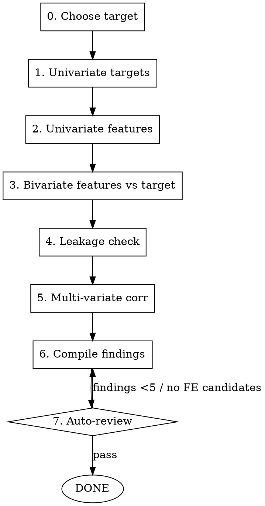

# EDA with Narrative

## Overview

The consigna says: "el EDA y el feature engineering deben leerse como una secuencia argumentativa". This skill enforces that. Every plot, every statistic, every table generates a labeled finding (`F-NN`) with an associated FE candidate and target relevance. The output is `reports/eda_findings.json` — the input to [[feature-engineering-justified]].

## When to use

- Right after data acquisition, before feature engineering
- User says "hacer EDA" / "explorar el dataset" / "ver qué hay en los datos"
- An `eda_findings.json` doesn't yet exist for this project

Do NOT use:
- Without a clear target column identified (decide target first)
- If you want general descriptive stats without modeling intent (use `pandas-profiling` instead)

## Workflow



### Step-by-step

1. **Choose target(s)**: identify candidates from business question. Distribution analysis of each candidate drives the problem type decision (classification / regression / hurdle / multi-output).
2. **Univariate targets** (FIRST — this drives architecture decisions):
   - Distribution: histogram, quartiles, mean/median
   - Missingness pattern: bar of null counts
   - Skew: numeric skew metric
   - **Decision generated**: classification vs regression vs hurdle?
3. **Univariate features**:
   - Numéricas: distribution + outliers + scaling needs
   - Categóricas: cardinality + top-K + Other bucket
   - Geo: distribution on map (lat/lon hex / scatter)
4. **Bivariate features ↔ target**: for each high-signal feature
   - Numéricas: scatter + Pearson + Spearman + R²
   - Categóricas: box per category + ANOVA F-stat
   - Statistical test: p-value reported
5. **Leakage check**: enumerate `FORBIDDEN_COLUMNS` — features not available at prediction time or derived from the target. Validate each is dropped before any modeling.
6. **Multi-variate correlations**: heatmap; flag pairs with |r| > 0.8 (collinearity).
7. **Compile findings**: build `eda_findings.json`.
8. **Auto-review**: ≥5 findings, each with `fe_candidate` non-null (`"drop"` is allowed and counts as a decision).

## Output spec

`reports/eda_findings.json`:

```json
[
  {
    "id": "F-01",
    "finding": "Target is heavily imbalanced (minority class = 6%)",
    "evidence": "univariate target distribution histogram",
    "figure": "reports/figures/eda_target_dist.png",
    "fe_candidate": "use class weights / resampling; pick macro-F1 as metric",
    "target_relevance": "high — drives metric and loss choice",
    "statistic": "6.1%",
    "p_value": null
  }
]
```

Required fields per finding:
- `id`: F-NN sequential
- `finding`: one-sentence description
- `evidence`: type of analysis (univariate / bivariate / leakage / etc.)
- `figure`: path to PNG (must exist)
- `fe_candidate`: concrete feature to build, OR the literal string `"drop"` if the finding implies removing the column. NEVER null — every finding has consequences for FE, even if the consequence is exclusion.
- `target_relevance`: "high" / "medium" / "low" with one-line justification
- `statistic`: numeric value supporting the finding
- `p_value`: if hypothesis test (else null)

Plus: `reports/figures/eda_*.png` with **interpretable caption embedded** (matplotlib `plt.title` or `plt.figtext`).

## <EXTREMELY-IMPORTANT> Rules

1. **Target univariate first.** It decides architecture (hurdle? multi-output? imbalanced classification?). Skipping this leads to picking the wrong model later.
2. **Every finding has an FE candidate.** "Just an observation" without an FE consequence isn't a finding — it's noise.
3. **Interpretable captions.** Every figure has a caption a non-technical reader can understand. Consigna evaluates this.
4. **Statistical tests, not eyeballing.** If a relationship looks strong, quantify it (Pearson, ANOVA, chi-square).
5. **Leakage check is mandatory.** Drop any feature unavailable at prediction time or derived from the target (post-outcome fields, IDs that encode the label, future-dated columns). Document the list as `FORBIDDEN_COLUMNS`.

## Red flags

| Thought | Reality |
|---|---|
| "Skew is mild, no need to log-transform" | Skew > 1 needs decision (log / Yeo-Johnson / leave). Document either way. |
| "Correlation 0.7 isn't significant, ignore" | With N=20k it's super significant. Use the right test, report p. |
| "I'll plot this later" | If it's not in `reports/figures/` with a caption, it doesn't exist for the consigna. |
| "Found 3 findings, that's enough" | <5 means surface-level EDA. Re-do bivariada. |
| "Will check leakage during FE" | Leakage check happens HERE. Anything FE does on leaked features is wasted work. |
