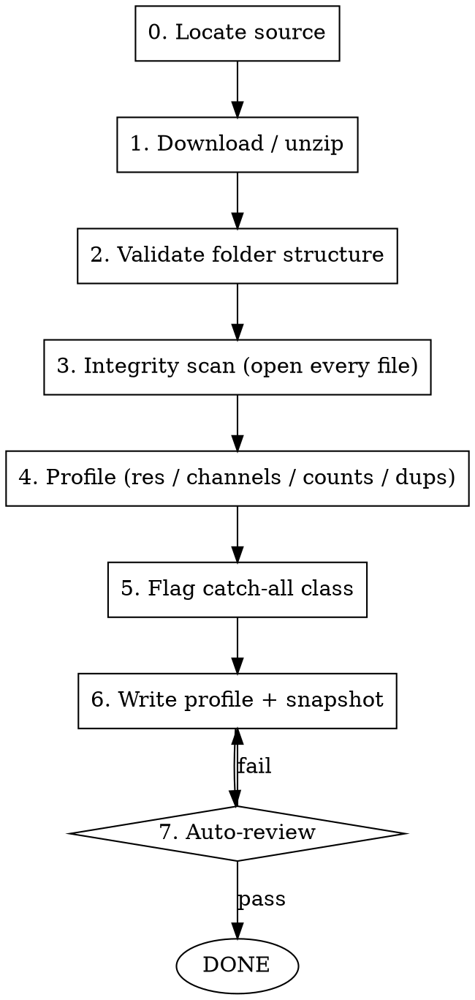

# Image Dataset Acquisition

## Overview

Image datasets fail differently than tabular ones: corrupt files, mixed resolutions,
hidden grayscale-as-RGB, leaked duplicates across classes, and a catch-all class that
must NOT enter training. This skill gets the data on disk and produces a **profile** that
the next phase ([[image-eda]]) and the whole modeling plan depend on. The output is
`reports/dataset_profile.json` + a documented `SNAPSHOT_INFO.md`.

## When to use

- Starting a CV/CNN project; data is on Kaggle, a zip, or a folder-per-class tree
- User says "bajar el dataset de imágenes" / "Kaggle dataset" / "tengo las carpetas"

Do NOT use:
- For tabular/CSV data (use a plain download + schema check)
- For Inside Airbnb (use [[inside-airbnb-acquisition]])

## Workflow



### Step-by-step

1. **Locate source.** Kaggle dataset slug, competition, a local zip, or an existing
   folder-per-class tree. Record the exact origin.
2. **Download / unzip.** Kaggle API (preferred for reproducibility) or unzip a local file.
   If the data already sits in `data/raw/<class>/`, skip to validation.
3. **Validate folder structure.** One subfolder per class; image files inside. Enumerate
   class names exactly as they appear on disk (case + spaces matter for labels).
4. **Integrity scan.** Open EVERY file with PIL (`Image.open(f).verify()` then reopen).
   Count and quarantine unreadable/zero-byte files. Never assume — open them all.
5. **Profile** (the deliverable): per-class counts, unique resolutions, channel analysis
   (is each "RGB" image actually grayscale, i.e. R==G==B?), format, and near-duplicate hash
   collisions across classes (leakage risk).
6. **Flag the catch-all class.** Many CV datasets ship an `Other`/`None`/`misc` bucket.
   Record it explicitly as `excluded_from_training` so downstream phases reserve it.
7. **Write** `reports/dataset_profile.json` + `data/raw/SNAPSHOT_INFO.md`.

## Code templates

**Kaggle API download (deterministic):**
```python
# Requires ~/.kaggle/kaggle.json (chmod 600). pip install kaggle
import subprocess, pathlib
def kaggle_download(slug: str, dest: str) -> None:
    pathlib.Path(dest).mkdir(parents=True, exist_ok=True)
    subprocess.run(["kaggle", "datasets", "download", "-d", slug, "-p", dest, "--unzip"], check=True)
```

**Integrity + channel profile (open every file, no sampling):**
```python
from pathlib import Path
from collections import Counter
from PIL import Image
import numpy as np

def profile_dir(root: str) -> dict:
    root = Path(root)
    classes = sorted(p.name for p in root.iterdir() if p.is_dir())
    counts, sizes, corrupt, grayscale_rgb = {}, Counter(), [], 0
    n_checked = 0
    for c in classes:
        files = [f for f in (root / c).iterdir() if f.suffix.lower() in {".jpg", ".jpeg", ".png"}]
        counts[c] = len(files)
        for f in files:
            try:
                a = np.asarray(Image.open(f).convert("RGB"))
            except Exception:
                corrupt.append(str(f)); continue
            sizes[a.shape] += 1
            # "RGB" that is really grayscale: all channels equal
            if a.ndim == 3 and np.array_equal(a[..., 0], a[..., 1]) and np.array_equal(a[..., 1], a[..., 2]):
                grayscale_rgb += 1
            n_checked += 1
    return {"classes": classes, "counts": counts, "resolutions": dict(sizes),
            "corrupt": corrupt, "grayscale_rgb_fraction": grayscale_rgb / max(n_checked, 1)}
```

## Output spec

- `reports/dataset_profile.json`:
  ```json
  {
    "source": "kaggle:aumthaker/mars-terrain-images",
    "classes": ["bright dune", "crater", "...", "other"],
    "counts": {"crater": 1056, "other": 3645, "...": 0},
    "defined_classes": ["crater", "bright dune", "..."],
    "excluded_from_training": ["other"],
    "resolutions": {"[227, 227, 3]": 6153},
    "grayscale_rgb_fraction": 1.0,
    "corrupt_files": [],
    "imbalance_ratio": 23.5,
    "duplicate_collisions_across_classes": 0
  }
  ```
- `data/raw/SNAPSHOT_INFO.md`: source URL/slug, download date, total files, per-class counts,
  license note.

## <EXTREMELY-IMPORTANT> Rules

1. **Open every file, no sampling.** Corrupt images crash training mid-epoch. The integrity
   scan runs on the FULL set (user feedback: exhaustive validation, not `.head()`).
2. **Channel reality check is mandatory.** A dataset stored as RGB may be grayscale (R==G==B).
   This single fact decides whether color experiments / 3-channel transfer learning make sense.
   Record `grayscale_rgb_fraction`.
3. **Catch-all class flagged, never silently trained.** Record `excluded_from_training`.
   Downstream phases must reserve it (consigna separates "Other").
4. **Cross-class duplicate check.** Identical images in two classes = label noise + split
   leakage. Hash and flag.
5. **Exact class names preserved.** Labels derive from folder names; case/spaces matter.

## Auto-review before handoff

Before passing to [[image-eda]]:
1. `dataset_profile.json` exists with non-empty `counts` for every class folder
2. `corrupt_files` reviewed (empty, or quarantined and documented)
3. `excluded_from_training` set if a catch-all class exists
4. `grayscale_rgb_fraction` recorded (decides color-experiment relevance)
5. `imbalance_ratio` computed (max/min defined-class count) — drives metric choice later

If any check fails, halt; do NOT start EDA on unprofiled/corrupt data.

## Red flags

| Thought | Reality |
|---|---|
| "Files look fine, skip the integrity scan" | One corrupt JPG crashes training at epoch 7. Open them all now. |
| "It's RGB, so it has color" | Many HiRISE/medical sets are grayscale-as-RGB. Verify R==G==B. |
| "I'll just include the Other folder, more data" | Catch-all contaminates the label space. Reserve it. |
| "Duplicates don't matter" | The same image in train (class A) and test (class B) inflates and corrupts metrics. |
| "Counts roughly balanced, probably" | Compute the ratio. CV class imbalance is usually severe and decides the metric. |
