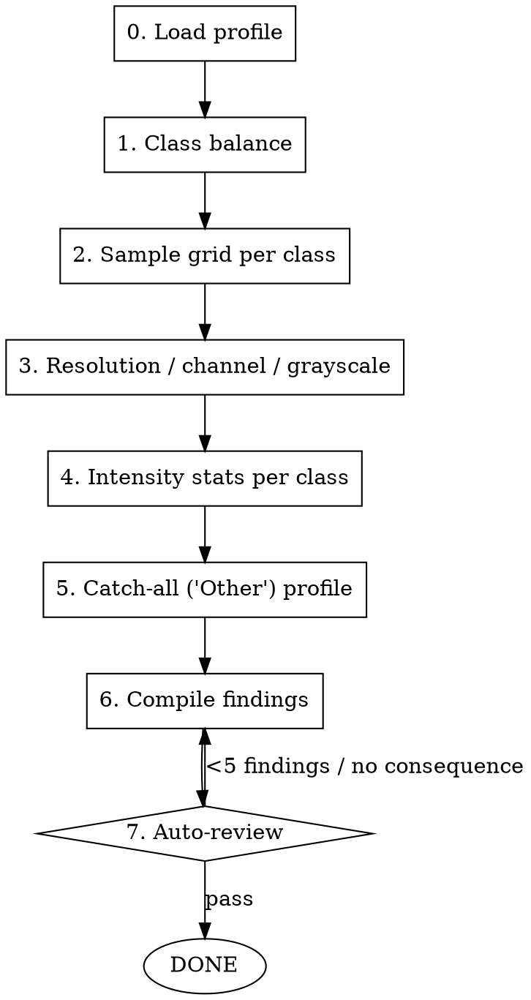

# Image EDA

## Overview

Image EDA is not tabular EDA: there are no columns to correlate. The findings come from
LOOKING at the images and from the statistics of the pixel arrays. Each finding must
generate a consequence for preprocessing or modeling (augmentation choice, metric choice,
class to watch in the confusion matrix). The output is `reports/image_eda_findings.json` —
the input to [[image-preprocessing-augmentation]].

## When to use

- Right after [[image-dataset-acquisition]], before preprocessing
- User says "EDA de imágenes" / "explorar el dataset de imágenes" / "mostrar ejemplos por clase"

Do NOT use:
- For tabular data (use [[eda-with-narrative]])
- Before the dataset is profiled (run acquisition first)

## Workflow



### Step-by-step

1. **Load** `reports/dataset_profile.json` (counts, resolutions, grayscale fraction).
2. **Class balance** (FIRST — drives the metric): bar plot of per-class counts; compute
   imbalance ratio. Decision generated: macro-F1 vs accuracy, class weights yes/no.
3. **Sample grid per class.** Plot a grid (e.g. 5 images × each class, including the
   catch-all). This is the consigna's required deliverable and seeds qualitative hypotheses
   (which classes look similar → likely confusion pairs).
4. **Resolution / channel / grayscale check.** Confirm a single target size; confirm whether
   images carry color or are grayscale-as-RGB. This decides: resize target, input channels,
   and whether the "does the kernel learn color?" experiment is meaningful.
5. **Intensity statistics per class.** Mean/std brightness histogram per class. Reveals
   whether a class is separable by global brightness alone (e.g. bright vs dark dune) — a
   confound the CNN might exploit instead of structure.
6. **Catch-all profile.** Visualize "Other": is it visually heterogeneous (true OOD) or does
   it contain images that resemble defined classes (re-labelable)? Frames the Task-6 analysis.
7. **Compile** `reports/image_eda_findings.json`.

## Code template (class balance + grid + grayscale, no sampling on the count)

```python
from pathlib import Path
from PIL import Image
import numpy as np, matplotlib.pyplot as plt

def class_counts(root: str) -> dict:
    root = Path(root)
    return {c.name: len(list(c.glob("*.jpg")) + list(c.glob("*.png")))
            for c in sorted(root.iterdir()) if c.is_dir()}

def sample_grid(root: str, classes: list[str], n: int, out: str) -> None:
    fig, axes = plt.subplots(len(classes), n, figsize=(n * 1.6, len(classes) * 1.6))
    for r, c in enumerate(classes):
        files = sorted((Path(root) / c).glob("*.jpg"))[:n]
        for k in range(n):
            ax = axes[r, k]
            ax.axis("off")
            if k < len(files):
                ax.imshow(Image.open(files[k]), cmap="gray")
            if k == 0:
                ax.set_ylabel(c, rotation=0, ha="right", va="center", fontsize=8)
    fig.suptitle("Ejemplos por clase (Mars Terrain)")
    fig.savefig(out, dpi=120, bbox_inches="tight"); plt.close(fig)
```

## Output spec

`reports/image_eda_findings.json`:
```json
[
  {
    "id": "F-01",
    "finding": "Severe imbalance: crater=1056 vs impact ejecta=45 (ratio 23:1)",
    "evidence": "class balance bar plot",
    "figure": "reports/figures/eda_class_counts.png",
    "consequence": "use macro-F1 as primary metric + class weights; flag small classes as high-variance in TEST",
    "statistic": "ratio 23.5"
  },
  {
    "id": "F-02",
    "finding": "All sampled images are grayscale stored as RGB (R==G==B)",
    "evidence": "channel analysis on full set",
    "figure": "reports/figures/eda_grid.png",
    "consequence": "train on 1 channel; the 'does the kernel learn color?' experiment will show RGB->BGR has no effect (strong honest finding)",
    "statistic": "grayscale_fraction=1.0"
  }
]
```
Required per finding: `id`, `finding`, `evidence`, `figure` (must exist), `consequence`
(non-null — every finding changes a downstream decision), `statistic`.

Plus `reports/figures/eda_*.png` with interpretable titles.

## <EXTREMELY-IMPORTANT> Rules

1. **Class balance first.** It decides the metric (macro-F1 vs accuracy) and whether to use
   class weights. Skipping it leads to reporting misleading accuracy.
2. **The sample grid is a required deliverable.** The consigna explicitly asks for "una grilla
   de ejemplos por categoría". Include the catch-all class.
3. **Every finding has a consequence.** A pretty plot with no downstream decision is noise.
4. **Confusion hypotheses come from EDA.** Note visually similar classes NOW; verify against
   the confusion matrix LATER. Closing that loop is the consigna's "por qué falla donde falla".
5. **Catch-all framed, not modeled.** Characterize "Other" as OOD vs re-labelable; this is the
   Task-6 narrative.

## Auto-review before handoff

Before passing to [[image-preprocessing-augmentation]]:
1. `image_eda_findings.json` has ≥5 findings, each with non-null `consequence`
2. Class-balance figure + per-class sample grid exist in `reports/figures/`
3. Metric decision (macro-F1?) recorded as a finding consequence
4. ≥1 confusion hypothesis (which classes look alike) recorded for later cross-check
5. Catch-all class characterized (OOD vs re-labelable)

If any check fails, re-do the missing analysis before preprocessing.

## Red flags

| Thought | Reality |
|---|---|
| "Counts look balanced enough" | Compute the ratio. CV imbalance is usually severe and decides the metric. |
| "I'll just show one example image" | Consigna asks a grid per category. Show several per class. |
| "Color experiment later" | Decide channels NOW from the grayscale check — it changes the input shape. |
| "EDA found nothing" | Then plot intensity per class and look at the grid again. Similar classes = future confusion. |
| "Other is just noise, ignore it" | Characterizing Other IS Task 6. Look at it now. |
