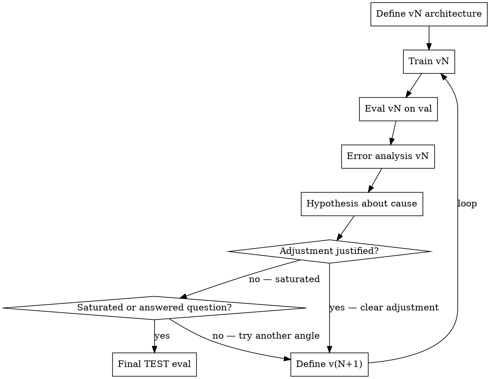

# NN Iteration with Error Analysis

## Overview

The consigna's CORE evaluation criterion: "el análisis de errores no es un apéndice del modelado, sino el motor de la siguiente iteración". This skill enforces that loop. Every model version (v1, v2, v3, ...) must justify its existence by an error pattern in the previous version. Default iterations (e.g., "add regularization") without an error pattern that justifies them are penalized.

The product of this skill is NOT a model. It's a **traceable narrative of iterations** with versioned `error_analysis_v{N}.md` files and `v{N}_metrics.json`.

## When to use

- After baselines (B0/B1/B2) have set the bar to beat
- User says "iterar NN", "v1 del modelo", "siguiente versión"
- A previous version exists and its error analysis points to a specific adjustment

Do NOT use:
- Without baselines first (you don't know what to beat)
- For hyperparameter sweeps with Optuna/Ray (different skill — this one is about narrative, not search)
- For inference / deployment (this is academic iteration)

## Workflow per iteration



### Steps for each version

1. **Define architecture vN** (concrete: layer counts, units, activations, dropout, loss, optimizer, callbacks)
2. **Train** with fixed seed, log curves
3. **Evaluate on val set** with metrics from `metrics_spec.json`
4. **Save**: `models/v{N}.keras`, `reports/v{N}_metrics.json`, `reports/figures/v{N}_training.png`
5. **Error analysis** (`reports/error_analysis_v{N}.md`):
   - **Layer 1**: metrics per head / per output (if multi-output)
   - **Layer 2**: residuals per bin (for regression), confusion matrix per class (for classif), per-segment metrics
   - **Layer 3**: top-N qualitative errors — pick 10 worst predictions, inspect them, look for patterns
   - **Hypothesis**: WHY does it fail there? (capacity? regularization? imbalance? feature missing? loss function mismatch?)
   - **Proposed adjustment for v(N+1)**: concrete change, traced to the error pattern
6. **Decision gate**:
   - If hypothesis points to a clear adjustment with high expected impact → proceed to v(N+1)
   - If saturated (3 versions, no improvement / errors are residual noise) → stop and final TEST eval
7. **Final TEST eval** (only ONCE, on the final chosen model)

## Output spec per version

- `models/v{N}.keras` (Keras native format)
- `reports/v{N}_metrics.json`:
  ```json
  {
    "version": N,
    "architecture": "<brief description>",
    "params_count": 25430,
    "train_loss": 0.123,
    "val_loss": 0.234,
    "metrics": {
      "primary_metric_name": 0.85,
      "...": "..."
    },
    "training_time_sec": 245,
    "epochs_run": 30
  }
  ```
- `reports/figures/v{N}_training.png` (loss curves train + val)
- `reports/error_analysis_v{N}.md`:
  ```markdown
  # Error analysis v{N}
  
  ## Layer 1 — metric per head/output
  ...
  
  ## Layer 2 — residual / confusion by bin/class
  ...
  
  ## Layer 3 — top-10 qualitative errors
  ...
  
  ## Hypothesis
  
  The two minority classes account for 80% of the errors, and their recall is < 0.3 while majority-class recall is > 0.9. The gap persists across train and val, ruling out overfit — the model is biased toward the majority class. The hypothesis is that the plain cross-entropy loss is dominated by the majority class; a regularization change won't fix a class-balance problem.

  ## Proposed adjustment for v{N+1}

  Add class weights (inverse frequency) to the loss, or switch to focal loss to down-weight easy majority examples. Keep the architecture; change only the loss/weighting.

  Traceability: hypothesis ← Layer 2 per-class recall ← Layer 1 macro-F1 vs accuracy gap.
  ```

## <EXTREMELY-IMPORTANT> Rules

1. **No iteration without error analysis.** v(N+1) cannot start without `error_analysis_v{N}.md` existing and pointing to a specific adjustment.
2. **No default adjustments.** "Add L2 regularization" is forbidden unless the error analysis shows overfit (train >> val). If train ≈ val, regularization is not the fix.
3. **One TEST eval only.** Don't peek at TEST during iteration. Only evaluate on TEST when the iteration is locked.
4. **Save everything per version.** Future you (or peer reviewers) will reconstruct the journey from these files.
5. **Saturation is OK.** If v3 doesn't improve v2 meaningfully, STOP. Three honest iterations with rigorous error analysis beat seven iterations with no narrative.

## Auto-review before handoff

Before passing to [[ds-business-insights]] (after final TEST eval, per user feedback `feedback_revalidate_outputs`):
1. Each vN has its triple: `models/v{N}.keras` + `reports/v{N}_metrics.json` + `reports/error_analysis_v{N}.md`
2. Each `error_analysis_v{N}.md` (except the last) names a concrete adjustment that became v{N+1}'s architecture change
3. The chosen FINAL version's TEST metrics don't degrade > 10% vs VAL metrics (else suspect leakage / overfit to val)
4. NO model version was trained with peeked-at TEST data — confirm splits never crossed
5. Training curves saved to `reports/figures/v{N}_training.png` for every version

If any check fails, halt and document; honest iteration narrative > flawless metrics with hidden bugs.

## Red flags

| Thought | Reality |
|---|---|
| "v2 added Dropout(0.3) because it's standard" | Standard isn't a hypothesis. What error in v1 motivates dropout? |
| "Let me peek at TEST to see if I'm improving" | NO. Use VAL. TEST is locked until final. |
| "v3 didn't improve, let me try v4 with embeddings" | Need to articulate WHY embeddings — what error in v3 do they fix? |
| "Lost the v1 model, I'll just retrain" | Then you lost v1 error analysis too. Save everything. |
| "v4 with focal loss is the obvious next step" | Obvious to you. Document the chain: v1 error → per-class recall gap → class imbalance → reweighting. |
